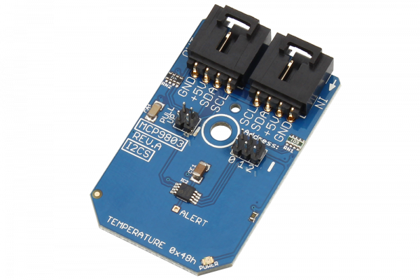

# MCP9803

The MCP9803 is a high accuracy temperature sensor with a programmable 9 to 12-Bit resolution and ±0.5°C accuracy at +25°C.This sensor operates between -55°C and +125°C with 200 µA operating current.
This Device is available from www.ncd.io 

[SKU: MCP9803_I2CS]

(https://store.ncd.io/product/mcp9803-high-accuracy-temperature-sensor-%C2%B10-5c-at-25c-i2c-mini-module/)
This Sample code can be used with Arduino.

Hardware needed to interface MCP9803 sensor with Arduino

1. <a href="https://store.ncd.io/product/i2c-shield-for-arduino-nano/">Arduino Nano</a>

2. <a href="https://store.ncd.io/product/i2c-shield-for-arduino-micro-with-i2c-expansion-port/">Arduino Micro</a>

3. <a href="https://store.ncd.io/product/i2c-shield-for-arduino-uno/">Arduino uno</a>

4. <a href="https://store.ncd.io/product/dual-i2c-shield-for-arduino-due-with-modular-communications-interface/">Arduino Due</a>

5. <a href="https://store.ncd.io/product/mcp9803-high-accuracy-temperature-sensor-%C2%B10-5c-at-25c-i2c-mini-module/">MCP9803 9-12Bit Temperature Sensor</a>

6. <a href="https://store.ncd.io/product/i%C2%B2c-cable/">I2C Cable</a>

MCP9803:

The MCP9803 is a high accuracy temperature sensor with a programmable 9 to 12-Bit resolution and ±0.5°C accuracy at +25°C.This sensor operates between -55°C and +125°C with 200 µA operating current.

Applications:

• Personal Computers and Servers

• Hard Disk Drives and Other PC Peripherals

• Entertainment Systems

• Office Equipment

• Data Communication Equipment

• Mobile Phones

• General Purpose Temperature Monitoring

How to Use the MCP9803 Arduino Library

The MCP9803 has a number of settings, which can be configured based on user requirements.
          
1.One shot mode:The following command is used to disable the one shot mode.

            mcp.setOneShot(ONESHOT_DISABLED);        // Disabled (Power-up default)
            
2.Shut down mode:The following command is used to disable the shut down mode.

             mcp.setShutdown(SHUTDOWN_DISABLE);      // Disable (Power-up default)
             
3.Resolution settings:The following command is used to set the resolution of temperature sensor as 12bits.            
             
             mcp.setResolution(RESOLUTION_12);       // 12 bit, data shifted right by 4 bits, multiply by 0.0625, (___>> 4) * 0.0625
             
             
             
             
             
